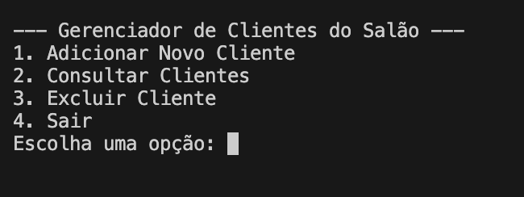

# 👤 Gerenciador de Clientes (CLI)

Aplicativo de linha de comando para cadastrar, listar, buscar, atualizar e remover clientes. Ideal para rotinas simples (ex.: salão de beleza).

## Como executar
No terminal, dentro da pasta do projeto, rode:

    python gerenciador_clientes.py

Em alguns Macs:

    python3 gerenciador_clientes.py

## Exemplo (fluxo típico)

- Cadastrar cliente → informar nome, telefone, serviço
- Listar clientes → visualizar todos
- Buscar/atualizar/remover → por nome ou telefone

## 📌 Roadmap (próximos passos)
- [ ] Persistir dados em arquivo (CSV/JSON)
- [ ] Validação de telefone (formato e duplicidade)
- [ ] Buscar por múltiplos campos (nome/telefone)
- [ ] Exportar relatório simples (CSV)
- [ ] Testes básicos (pytest)

- [ ] Testes básicos (pytest)

